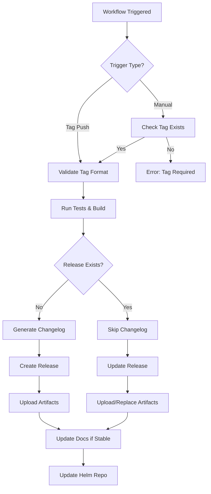

# Release Workflow Documentation

This document explains how the release workflow handles different scenarios, including creating releases on existing tags.

## Table of Contents

- [Overview](#overview)
- [Automatic Release (Tag Push)](#automatic-release-tag-push)
- [Manual Release (Existing Tag)](#manual-release-existing-tag)
- [Workflow Scenarios](#workflow-scenarios)
- [Triggering Methods](#triggering-methods)
- [Release Artifacts](#release-artifacts)
- [Troubleshooting](#troubleshooting)

## Overview

The release workflow (`release.yml`) supports two main triggering methods:

1. **Automatic**: Triggered when a tag matching `v*.*.*` or `*.*.*` is pushed
2. **Manual**: Triggered via GitHub Actions UI using `workflow_dispatch`

The workflow intelligently handles three scenarios:
- Tag and release don't exist → Create both
- Tag exists, release doesn't exist → Create release on existing tag
- Tag and release both exist → Update release assets

## Automatic Release (Tag Push)

This is the standard release process when you push a new tag.

### Steps:

1. **Create and push a tag**:
   ```bash
   git tag -a v0.0.14 -m "Release v0.0.14: Add new feature"
   git push origin v0.0.14
   ```

2. **Workflow automatically triggers** and performs:
   - ✓ Validates tag format
   - ✓ Runs tests
   - ✓ Builds multi-arch Docker images
   - ✓ Generates Kubernetes manifests
   - ✓ Packages Helm chart
   - ✓ Runs security scans
   - ✓ Creates GitHub release with all artifacts
   - ✓ Updates documentation (for stable releases)
   - ✓ Updates Helm repository

### Tag Format:

- **Stable releases**: `v1.2.3` or `1.2.3`
- **Pre-releases**: `v1.2.3-alpha`, `v1.2.3-beta`, `v1.2.3-rc1`

## Manual Release (Existing Tag)

Use this when you have an existing tag but need to create or update the release.

### Common Use Cases:

1. **Tag exists but release failed**: Workflow failed after tag was pushed but before release creation
2. **Recreate release**: Need to regenerate release with updated artifacts
3. **Add missing artifacts**: Release exists but some artifacts are missing

### Steps:

1. **Navigate to GitHub Actions**:
   - Go to your repository on GitHub
   - Click on "Actions" tab
   - Select "Release" workflow from the left sidebar

2. **Run workflow manually**:
   - Click "Run workflow" button (top right)
   - Select branch: `main`
   - Enter tag name: `v0.0.13`
   - Click "Run workflow"

3. **Workflow behavior**:
   ```
   IF tag exists AND release doesn't exist:
     → Create release on existing tag
     → Upload all artifacts
   
   IF tag exists AND release exists:
     → Update existing release
     → Re-upload artifacts (with --clobber to replace)
   
   IF tag doesn't exist:
     → Fail with error message
   ```

## Workflow Scenarios

### Scenario 1: Fresh Release (Normal Flow)

```
State: No tag, no release
Action: git push origin v0.0.14
Result: ✓ Tag created → ✓ Release created → ✓ Artifacts uploaded
```

### Scenario 2: Tag Exists, No Release

```
State: Tag v0.0.13 exists, release doesn't exist
Action: Manual workflow dispatch with tag=v0.0.13
Result: ✓ Check tag exists → ✓ Create release on tag → ✓ Upload artifacts

Example output:
=========================================
Creating GitHub Release for tag: v0.0.13
Tag exists: true
Release exists: false
=========================================
✓ Release v0.0.13 created successfully
```

### Scenario 3: Both Tag and Release Exist

```
State: Tag v0.0.13 exists, release exists
Action: Manual workflow dispatch with tag=v0.0.13
Result: ✓ Check tag exists → ✓ Skip release creation → ✓ Update artifacts

Example output:
=========================================
Updating existing release: v0.0.13
=========================================
✓ Assets uploaded successfully to release v0.0.13
```

### Scenario 4: Tag Doesn't Exist (Error)

```
State: No tag v0.0.99
Action: Manual workflow dispatch with tag=v0.0.99
Result: ✗ Error: Tag v0.0.99 must exist before creating a release

Only happens with manual trigger - automatic trigger creates tag first.
```

## Triggering Methods

### Method 1: Automatic (Tag Push)

```bash
# Create annotated tag
git tag -a v0.0.14 -m "feat: add awesome feature

- New feature A
- Bug fix B
- Performance improvement C"

# Push tag
git push origin v0.0.14
```

**Pros**: Automatic, integrated into Git workflow
**Cons**: Can't be re-run without deleting and recreating tag

### Method 2: Manual (GitHub UI)

**Navigation**:
```
GitHub Repository → Actions → Release → Run workflow
```

**Input**:
- Branch: `main` (or appropriate branch)
- Tag: `v0.0.13` (must exist)

**Pros**: Can be re-run anytime, doesn't require Git operations
**Cons**: Manual process

### Method 3: Manual (GitHub CLI)

```bash
# Trigger workflow with gh CLI
gh workflow run release.yml \
  --ref main \
  --field tag=v0.0.13
```

**Pros**: Scriptable, can be automated
**Cons**: Requires GitHub CLI installation

## Release Artifacts

Each release includes the following artifacts:

### 1. Installation Manifest
- **File**: `install.yaml`
- **Description**: Complete Kubernetes manifest for deploying the operator
- **Usage**: `kubectl apply -f install.yaml`

### 2. Manifests Archive
- **File**: `traktor-{version}-manifests.tar.gz`
- **Description**: Archive of all Kubernetes manifests (CRDs, RBAC, Deployment)
- **Contents**: Individual YAML files from `config/` directory

### 3. SBOM (Software Bill of Materials)
- **File**: `sbom-{version}.spdx.json`
- **Description**: Software composition analysis in SPDX format
- **Purpose**: Security auditing and compliance

### 4. Helm Chart
- **File**: `traktor-{version}.tgz`
- **Description**: Helm chart package
- **Usage**: `helm install traktor traktor-{version}.tgz`

### 5. Helm Repository Index
- **File**: `index.yaml`
- **Description**: Helm repository metadata
- **Purpose**: Helm repository management

## Troubleshooting

### Problem: Workflow fails with "Release already exists"

**Solution**: This shouldn't happen anymore. The workflow now updates existing releases.

```bash
# If you encounter this, the workflow will automatically:
# 1. Detect the existing release
# 2. Upload assets with --clobber flag (replace existing)
```

### Problem: Tag exists but release creation fails

**Symptoms**:
```
✓ Tag v0.0.13 exists
✗ Release creation failed
```

**Solution**:
1. Check workflow logs for specific error
2. Fix the issue (e.g., missing artifacts, permissions)
3. Re-run workflow manually via GitHub UI

**Steps**:
```
Actions → Release → Run workflow → Enter tag: v0.0.13
```

### Problem: Wrong artifacts in release

**Solution**: Re-run workflow to update artifacts

```bash
# The workflow will:
# 1. Regenerate all artifacts
# 2. Upload with --clobber to replace existing files
```

### Problem: Need to recreate release from scratch

**Solution**:
1. Delete the release (keeps tag):
   ```bash
   gh release delete v0.0.13 --yes
   ```

2. Re-run workflow:
   ```bash
   gh workflow run release.yml --ref main --field tag=v0.0.13
   ```

### Problem: Tag doesn't exist for manual trigger

**Error**: `✗ Tag v0.0.99 does not exist`

**Solution**: Create the tag first:
```bash
git tag -a v0.0.99 -m "Release v0.0.99"
git push origin v0.0.99
```

## Workflow Logic Flow



## Best Practices

### 1. Use Semantic Versioning

```bash
# Major version: Breaking changes
v1.0.0 → v2.0.0

# Minor version: New features, backward compatible
v1.0.0 → v1.1.0

# Patch version: Bug fixes
v1.0.0 → v1.0.1

# Pre-release: Testing
v1.0.0-alpha, v1.0.0-beta, v1.0.0-rc1
```

### 2. Write Descriptive Tag Messages

```bash
# Good
git tag -a v0.0.14 -m "feat: add support for external secrets

- Add ExternalSecret CRD integration
- Support HashiCorp Vault authentication
- Update documentation with examples"

# Bad
git tag -a v0.0.14 -m "new version"
```

### 3. Verify Before Release

```bash
# Run tests locally
make test

# Build and test Docker image
make docker-build docker-push IMG=test-image:v0.0.14

# Test Helm chart
helm lint charts/traktor
helm template traktor charts/traktor --debug
```

### 4. Monitor Workflow Execution

- Watch the Actions tab during release
- Check for any warnings or errors
- Verify all artifacts are uploaded correctly
- Test the release installation

## Examples

### Example 1: Create New Release

```bash
# 1. Commit your changes
git add .
git commit -m "feat: implement new feature"
git push origin main

# 2. Create tag
git tag -a v0.0.14 -m "Release v0.0.14"

# 3. Push tag (triggers workflow)
git push origin v0.0.14

# 4. Monitor in GitHub Actions
# Actions → Release → Check progress
```

### Example 2: Fix Failed Release

```bash
# Scenario: Tag v0.0.13 was pushed but release failed

# 1. Go to GitHub Actions UI
# 2. Click "Release" workflow
# 3. Click "Run workflow"
# 4. Enter tag: v0.0.13
# 5. Click "Run workflow" button

# The workflow will:
# - Check that tag v0.0.13 exists ✓
# - See that release doesn't exist
# - Create release on existing tag
# - Upload all artifacts
```

### Example 3: Update Release Artifacts

```bash
# Scenario: Release v0.0.13 exists but you need to update Helm chart

# 1. Make changes to Helm chart
git add charts/
git commit -m "fix: update Helm chart values"
git push origin main

# 2. Manually trigger workflow
# Actions → Release → Run workflow
# Tag: v0.0.13

# The workflow will:
# - Check that tag and release exist ✓
# - Rebuild all artifacts
# - Upload with --clobber (replace existing)
```

## CI/CD Integration

### GitHub Actions Secrets Required

- `GITHUB_TOKEN`: Automatically provided, used for release creation
- No additional secrets needed for basic functionality

### Permissions Required

The workflow needs these permissions:
```yaml
permissions:
  contents: write        # Create releases, push tags
  packages: write        # Push Docker images
  pull-requests: read    # Read PR information
  repository-projects: read
```

## Summary

The release workflow now handles **all scenarios** related to tags and releases:

✅ **Automatic release on tag push** - Standard workflow  
✅ **Manual release on existing tag** - For recovery or updates  
✅ **Update existing releases** - Replace artifacts as needed  
✅ **Clear error messages** - Know exactly what went wrong  
✅ **Idempotent operations** - Safe to re-run multiple times  

This makes the release process **more robust** and **easier to manage**, especially when things don't go as planned.

---

**Related Documentation**:
- [DEPLOYMENT.md](../DEPLOYMENT.md) - Deployment guide
- [RELEASE.md](../RELEASE.md) - Release process overview
- [.github/workflows/release.yml](../.github/workflows/release.yml) - Workflow source code